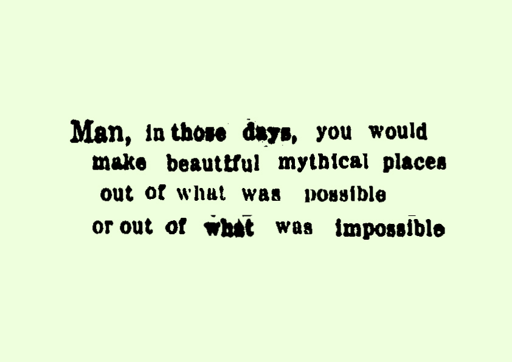

# cutups
Using OCR to make digital cutups

## example



## usage

first install tesseract:

```
> sudo apt install tesseract-ocr
```

then download a high-quality newspaper (or other document). I like the papers from [Library of Congress](https://chroniclingamerica.loc.gov/).

then convert the document into a `1.hocr` file:

```
> tesseract <your-downloaded-image.jpg> 1 -c hocr_font_info=1 -c hocr_char_boxes=1 txt hocr
```

## license

mit